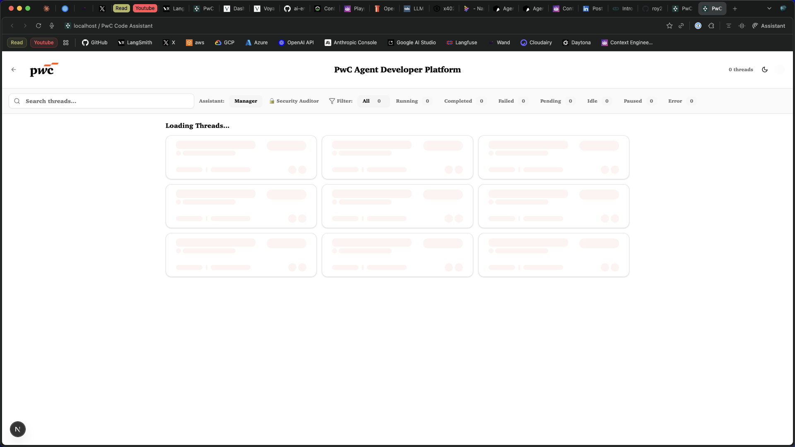

<div align="center">
  

  <br><br>

  <picture>
    <source media="(prefers-color-scheme: dark)" srcset="apps/docs/logo/dark.svg">
    <source media="(prefers-color-scheme: light)" srcset="apps/docs/logo/light.svg">
    
  </picture>
</div>

<div align="center">
  <h1>PwC Code Assistant - Enterprise AI-Powered Development Platform</h1>
</div>

PwC Code Assistant is an enterprise-grade AI-powered development platform built on advanced asynchronous coding agent technology. Developed by PwC's advanced AI team, it autonomously understands codebases, plans solutions, and executes code changes across entire repositories—from initial planning to opening pull requests with built-in security auditing.

> [!TIP]
> This is an enterprise-grade customization of the Open SWE platform, tailored specifically for PwC's development workflows and security requirements.
>
> **Note: you're required to set your own LLM API keys to use the platform.**

> [!NOTE]
> 📚 Built on the foundation of Open SWE with enhanced security auditing capabilities
>
> 🔒 Features PwC's specialized Security Auditor agent for automated code review
>
> 🚀 Optimized for enterprise development workflows and compliance

# Features



## Core Capabilities

- 📝 **Strategic Planning**: PwC Code Assistant features an advanced planning agent that deeply analyzes complex codebases and creates comprehensive implementation strategies. You maintain full control to accept, edit, or reject proposed plans before execution.
- 🔒 **Security-First Development**: Integrated Security Auditor agent automatically scans all code changes for vulnerabilities, ensuring compliance with enterprise security standards.
- 🤝 **Human-in-the-Loop Architecture**: Maintain real-time interaction during both planning and execution phases, allowing for immediate feedback and course correction without interrupting the workflow.
- 🏃 **Enterprise-Scale Parallel Execution**: Run multiple development tasks simultaneously in isolated sandbox environments, with no limitations on concurrent operations.
- 🧑‍💻 **Complete Development Lifecycle**: Automatically manage GitHub issues, create pull requests, and conduct security audits—providing end-to-end task management from conception to deployment.

## Specialized Agents

### 🧠 Development Agent
Intelligent development assistant created by PwC's advanced AI team, capable of understanding complex business requirements and implementing robust solutions.

### 📋 Strategic Planner
PwC's strategic code planning assistant that creates detailed implementation roadmaps considering both technical and business requirements.

### 👔 Project Manager
Intelligent AI software engineering coordinator that orchestrates multiple agents and ensures project alignment with enterprise standards.

### 🛡️ Security Auditor
PwC's specialized cybersecurity analyst that performs automated code reviews, vulnerability scanning, and compliance verification.


## Usage

PwC Code Assistant can be deployed and used in multiple ways:

### 🖥️ Web Interface
Access the full-featured web application to create, manage, and execute development tasks with real-time monitoring and control.

### 📝 GitHub Integration
Trigger PwC Code Assistant directly from GitHub issues using specialized labels:
- `pwc-assist`: Standard assistance with manual plan approval
- `pwc-assist-auto`: Automatic plan execution without manual intervention
- `pwc-assist-max`: Enhanced performance mode using Claude Opus 4.1
- `pwc-assist-max-auto`: Maximum performance with automatic execution

### 🔧 Local Development

#### Prerequisites
- Node.js 18+
- npm or yarn
- Git
- Valid API keys for your preferred LLM provider

#### Quick Start

```bash
# Clone the repository
git clone https://github.com/your-org/pwc-code-assistant.git
cd pwc-code-assistant

# Install dependencies
npm install

# Configure environment variables
cp .env.example .env
# Edit .env with your API keys and configuration

# Run development servers
npm run dev
```

#### Environment Configuration

Create a `.env` file with the following variables:

```env
# Frontend configuration
NEXT_PUBLIC_API_URL=http://localhost:3002/api

# LLM Provider Keys (choose one or more)
ANTHROPIC_API_KEY=your_anthropic_key
OPENAI_API_KEY=your_openai_key

# GitHub Integration
GITHUB_TOKEN=your_github_token
GITHUB_WEBHOOK_SECRET=your_webhook_secret

# Security Configuration
ENABLE_SECURITY_AUDIT=true
SECURITY_SCAN_LEVEL=strict
```

## Architecture

PwC Code Assistant is built with a microservices architecture:

- **Frontend**: Next.js application (Port 3002)
- **Backend API**: LangGraph-powered agent orchestration (Port 2024)
- **Documentation**: Mintlify docs (Port 3003)
- **Agents**: Modular, specialized AI agents for different aspects of development

## Development Commands

```bash
npm run dev           # Start all services
npm run clean         # Clean build artifacts
npm run validate-env  # Validate environment configuration
npm run test         # Run test suite
npm run build        # Build for production
```

## Security & Compliance

PwC Code Assistant includes enterprise-grade security features:

- 🔐 Automated vulnerability scanning on all code changes
- 📊 Compliance verification against enterprise standards
- 🛡️ Built-in security auditing agent
- 🔍 Real-time threat detection and mitigation
- 📝 Detailed security reports and recommendations

## Contributing

We welcome contributions that enhance the platform's capabilities while maintaining enterprise security standards. Please see our [Contributing Guidelines](CONTRIBUTING.md) for more information.

## License

This project is based on Open SWE and customized for PwC's enterprise requirements. See [LICENSE](LICENSE) for details.

## Support

For support, please contact the PwC Development Team or create an issue in the GitHub repository.

---

<div align="center">
  <sub>Built with ❤️ by PwC's Advanced AI Team</sub>
</div>

